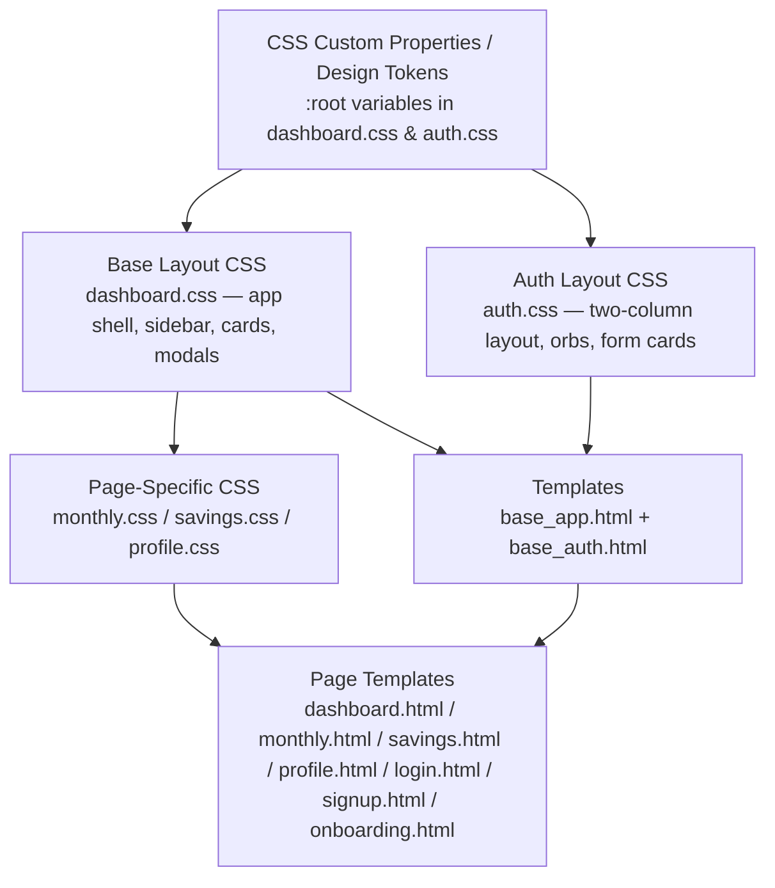
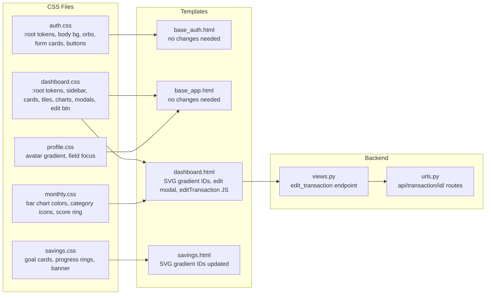

# Design Document: App Aesthetics — Color Palette & Visual Redesign

## Overview

SpendWise is a personal finance/savings Django web app with a multi-page UI (auth pages, dashboard, monthly analysis, savings goals, profile). The current design uses an Apple-inspired glassmorphism style with a neutral grey-blue background (`#e8e8ed`) and a single indigo accent (`#5e5ce6`). The goal of this feature is to elevate the visual identity with a richer, more expressive aesthetic color palette — warmer gradients, vibrant accent tones, and polished micro-details — while preserving the existing glassmorphism architecture and full responsive layout.

The redesign touches every CSS file (`auth.css`, `dashboard.css`, `monthly.css`, `profile.css`, `savings.css`), the two base templates (`base_app.html`, `base_auth.html`), and adds a Transaction Edit endpoint to the Django backend (`views.py`, `urls.py`). No other Django models or URL logic changes are required.

---

## Architecture

The styling system is layered as follows:



All color decisions flow from CSS custom properties defined in `:root`. Changing the token values propagates the new palette across every component automatically.

---

## Components and Interfaces

### Component 1: Design Token Layer (`:root` variables)

**Purpose**: Single source of truth for all colors, shadows, and radii. Changing tokens here cascades the entire redesign.

**Current tokens → New tokens:**

```css
/* CURRENT */
:root {
  --bg:         #e8e8ed;           /* flat cool grey */
  --accent:     #5e5ce6;           /* single indigo */
  --positive:   #30d158;
  --negative:   #ff453a;
  --cyan:       #67e8f9;
  --purple-t:   #c4b5fd;
  --green-t:    #bbf7d0;
  --yellow-t:   #fde68a;
}

/* NEW — Aesthetic Warm-Violet palette */
:root {
  /* Backgrounds */
  --bg:           #f0eef8;          /* soft lavender-white base */
  --bg-gradient:  linear-gradient(
                    145deg,
                    #ede9f6 0%,
                    #f5f0ff 40%,
                    #eaf4ff 100%
                  );

  /* Glass surfaces */
  --glass:        rgba(255, 255, 255, 0.78);
  --glass-2:      rgba(255, 255, 255, 0.60);

  /* Borders */
  --border:       rgba(255, 255, 255, 0.90);
  --border-sub:   rgba(210, 200, 230, 0.45);

  /* Typography */
  --ink:          #1a1625;          /* deep violet-black */
  --ink-2:        #2d2640;
  --muted:        #8b82a8;          /* violet-tinted muted */
  --sub:          #5c5478;

  /* Primary accent — vibrant violet */
  --accent:       #7c3aed;          /* vivid violet */
  --accent-lt:    rgba(124, 58, 237, 0.10);
  --accent-2:     #a855f7;          /* lighter violet */

  /* Semantic */
  --positive:     #10b981;          /* emerald green */
  --negative:     #f43f5e;          /* rose red */

  /* Shadows */
  --shadow-sm:    0 2px 10px rgba(100, 60, 180, 0.08);
  --shadow-md:    0 6px 28px rgba(100, 60, 180, 0.12);
  --shadow-lg:    0 18px 52px rgba(100, 60, 180, 0.16);

  /* Category tile palette — more vibrant */
  --cyan:         #67e8f9;
  --cyan-ink:     #0c4a6e;
  --purple-t:     #ddd6fe;
  --purple-ink:   #4c1d95;
  --green-t:      #a7f3d0;
  --green-ink:    #064e3b;
  --yellow-t:     #fde68a;
  --yellow-ink:   #78350f;
  --rose-t:       #fecdd3;
  --rose-ink:     #881337;
}
```

**Responsibilities**:
- Defines the entire color vocabulary for the app
- Enables global palette swap without touching component CSS
- Provides semantic aliases (`--positive`, `--negative`, `--accent`) used throughout

---

### Component 2: Body Background

**Purpose**: Replace the flat grey background with a living gradient that gives depth.

**Interface** (applied to `body` in `dashboard.css` and `auth.css`):

```css
body {
  background: var(--bg);
  background-image: var(--bg-gradient),
    radial-gradient(ellipse at 10% 5%,  rgba(167, 139, 250, 0.18) 0%, transparent 45%),
    radial-gradient(ellipse at 90% 95%, rgba(96,  165, 250, 0.14) 0%, transparent 45%),
    radial-gradient(ellipse at 50% 50%, rgba(244, 114, 182, 0.08) 0%, transparent 60%);
}
```

**Responsibilities**:
- Creates a soft lavender-to-sky ambient gradient
- Subtle violet and blue radial glows add depth without distraction
- Works on both app shell and auth pages

---

### Component 3: Sidebar

**Purpose**: Elevate the icon-only sidebar with a richer glass surface and a gradient accent for the active state.

**Interface**:

```css
.sidebar {
  background: linear-gradient(
    180deg,
    rgba(255, 255, 255, 0.82) 0%,
    rgba(245, 240, 255, 0.75) 100%
  );
  backdrop-filter: blur(24px) saturate(2.0);
  border-right: 1px solid rgba(200, 185, 240, 0.35);
}

.nav-icon.active {
  background: linear-gradient(135deg, #7c3aed 0%, #a855f7 100%);
  color: #fff;
  box-shadow: 0 4px 14px rgba(124, 58, 237, 0.35);
}

.nav-icon:hover {
  background: rgba(124, 58, 237, 0.10);
  color: var(--accent);
}
```

**Responsibilities**:
- Active nav item gets a vivid violet gradient pill (not just a tint)
- Hover state uses the new accent tint
- Glass surface picks up the lavender background

---

### Component 4: Cards (Glass Cards)

**Purpose**: Refine the glass card surface with a warmer tint and more expressive shadows.

**Interface**:

```css
.card {
  background: var(--glass);
  border: 1px solid var(--border);
  box-shadow:
    0 1px 0 rgba(255, 255, 255, 0.85) inset,
    var(--shadow-md);
  backdrop-filter: blur(22px) saturate(1.8);
}

/* Accent-tinted card variants */
.balance-card {
  background: linear-gradient(
    135deg,
    rgba(237, 233, 255, 0.85) 0%,
    rgba(224, 231, 255, 0.80) 100%
  );
}

.savings-card {
  background: linear-gradient(
    135deg,
    rgba(209, 250, 229, 0.80) 0%,
    rgba(224, 242, 254, 0.75) 100%
  );
}

.insights-card {
  background: linear-gradient(
    135deg,
    rgba(253, 230, 138, 0.25) 0%,
    rgba(252, 211, 77,  0.15) 30%,
    rgba(255, 255, 255, 0.80) 100%
  );
}
```

**Responsibilities**:
- Each semantic card type gets a unique tinted gradient background
- Shadows use violet-tinted color (not plain black) for warmth
- Inset highlight preserved for the glass "top edge" effect

---

### Component 5: Buttons — Complete Aesthetic System

**Purpose**: Apply a cohesive, semantic color system to every button in the app. Each button role gets a distinct gradient identity. All buttons share consistent hover lift, inset highlight, and colored shadow.

**Button Inventory & Role Mapping:**

| Button | Class | Role | Color |
|---|---|---|---|
| + Add Transaction | `.add-txn-btn` | Primary / Income | Emerald green |
| Edit/Set Salary | `.set-salary-btn` | Primary / Neutral | Violet → fuchsia |
| + Add Expense | `.add-expense-btn` | Danger | Rose → pink |
| Edit/Set Target | `.set-target-btn` | Ghost / Secondary | Violet ghost |
| Save (modals) | `.modal-save-btn` | Confirm | Violet → fuchsia |
| Add Goal | `.add-goal-btn` | Primary | Violet → fuchsia |
| Contribute | `.sv-contribute-btn` | Secondary | Violet ghost |
| Edit Transaction | `.txn-edit-btn` | Neutral edit | Sky blue → indigo |
| Delete (×) | `.txn-delete`, `.esc-delete` | Destructive | Rose ghost → solid on hover |
| Filter tabs | `.filter-tab` | Toggle | Ghost → violet active |
| Month nav | `.month-btn` | Icon nav | Ghost → violet tint |
| Go to Dashboard | `.ma-reminder-btn` | CTA link-button | Amber → orange |
| Auth submit | `.auth-btn` | Auth primary | Violet → fuchsia |

**Interface**:

```css
/* ── Shared button base ─────────────────────────────── */
button, .auth-btn, .ma-reminder-btn {
  font-weight: 600;
  letter-spacing: 0.01em;
  border-radius: 12px;
  border: none;
  cursor: pointer;
  transition: background 0.18s, box-shadow 0.18s, transform 0.14s;
}

/* ── PRIMARY: Add Transaction (emerald) ─────────────── */
.add-txn-btn {
  background: linear-gradient(135deg, #10b981 0%, #34d399 60%, #6ee7b7 100%);
  color: #fff;
  box-shadow: 0 4px 16px rgba(16, 185, 129, 0.32),
              0 1px 0 rgba(255, 255, 255, 0.22) inset;
}
.add-txn-btn:hover {
  background: linear-gradient(135deg, #059669 0%, #10b981 60%, #34d399 100%);
  box-shadow: 0 8px 24px rgba(16, 185, 129, 0.42),
              0 1px 0 rgba(255, 255, 255, 0.22) inset;
  transform: translateY(-1px);
}

/* ── PRIMARY: Set/Edit Salary (violet → fuchsia) ────── */
.set-salary-btn {
  background: linear-gradient(135deg, #7c3aed 0%, #a855f7 60%, #c026d3 100%);
  color: #fff;
  box-shadow: 0 4px 18px rgba(124, 58, 237, 0.38),
              0 1px 0 rgba(255, 255, 255, 0.20) inset;
}
.set-salary-btn:hover {
  background: linear-gradient(135deg, #6d28d9 0%, #9333ea 60%, #a21caf 100%);
  box-shadow: 0 8px 28px rgba(124, 58, 237, 0.48),
              0 1px 0 rgba(255, 255, 255, 0.20) inset;
  transform: translateY(-1px);
}

/* ── DANGER: Add Expense (rose → pink) ──────────────── */
.add-expense-btn {
  background: linear-gradient(135deg, #f43f5e 0%, #fb7185 60%, #fda4af 100%);
  color: #fff;
  box-shadow: 0 4px 16px rgba(244, 63, 94, 0.32),
              0 1px 0 rgba(255, 255, 255, 0.20) inset;
}
.add-expense-btn:hover {
  background: linear-gradient(135deg, #e11d48 0%, #f43f5e 60%, #fb7185 100%);
  box-shadow: 0 8px 24px rgba(244, 63, 94, 0.42),
              0 1px 0 rgba(255, 255, 255, 0.20) inset;
  transform: translateY(-1px);
}

/* ── CONFIRM: Modal Save / Add Goal (violet → fuchsia) ─ */
.modal-save-btn,
.add-goal-btn {
  background: linear-gradient(135deg, #7c3aed 0%, #a855f7 60%, #c026d3 100%);
  color: #fff;
  box-shadow: 0 4px 18px rgba(124, 58, 237, 0.38),
              0 1px 0 rgba(255, 255, 255, 0.20) inset;
}
.modal-save-btn:hover,
.add-goal-btn:hover {
  background: linear-gradient(135deg, #6d28d9 0%, #9333ea 60%, #a21caf 100%);
  box-shadow: 0 8px 28px rgba(124, 58, 237, 0.48),
              0 1px 0 rgba(255, 255, 255, 0.20) inset;
  transform: translateY(-1px);
}

/* ── GHOST: Set Target / Contribute (violet ghost) ───── */
.set-target-btn,
.sv-contribute-btn {
  background: rgba(124, 58, 237, 0.10);
  color: var(--accent);
  border: 1px solid rgba(124, 58, 237, 0.22);
  box-shadow: none;
}
.set-target-btn:hover,
.sv-contribute-btn:hover {
  background: rgba(124, 58, 237, 0.18);
  border-color: rgba(124, 58, 237, 0.40);
  box-shadow: 0 4px 14px rgba(124, 58, 237, 0.18);
  transform: translateY(-1px);
}

/* ── EDIT: Edit Transaction (sky blue → indigo) ──────── */
.txn-edit-btn {
  background: linear-gradient(135deg, #38bdf8 0%, #818cf8 100%);
  color: #fff;
  font-size: 0.72rem;
  padding: 3px 10px;
  border-radius: 8px;
  box-shadow: 0 2px 10px rgba(56, 189, 248, 0.28);
}
.txn-edit-btn:hover {
  background: linear-gradient(135deg, #0ea5e9 0%, #6366f1 100%);
  box-shadow: 0 4px 16px rgba(56, 189, 248, 0.38);
  transform: translateY(-1px);
}

/* ── DESTRUCTIVE: Delete buttons (ghost → rose) ──────── */
.txn-delete,
.esc-delete {
  background: transparent;
  color: var(--muted);
  border: none;
  border-radius: 6px;
  transition: background 0.15s, color 0.15s;
}
.txn-delete:hover,
.esc-delete:hover {
  background: rgba(244, 63, 94, 0.12);
  color: #f43f5e;
}

/* ── TOGGLE: Filter tabs ─────────────────────────────── */
.filter-tab {
  background: rgba(124, 58, 237, 0.06);
  color: var(--muted);
  border: 1px solid transparent;
  border-radius: 10px;
  padding: 5px 14px;
  font-size: 0.82rem;
}
.filter-tab.active {
  background: linear-gradient(135deg, #7c3aed 0%, #a855f7 100%);
  color: #fff;
  border-color: transparent;
  box-shadow: 0 3px 12px rgba(124, 58, 237, 0.30);
}
.filter-tab:hover:not(.active) {
  background: rgba(124, 58, 237, 0.12);
  color: var(--accent);
}

/* ── NAV: Month prev/next buttons ────────────────────── */
.month-btn {
  background: rgba(124, 58, 237, 0.08);
  color: var(--accent);
  border: 1px solid rgba(124, 58, 237, 0.18);
  border-radius: 8px;
  width: 30px; height: 30px;
}
.month-btn:hover {
  background: rgba(124, 58, 237, 0.18);
  box-shadow: 0 2px 10px rgba(124, 58, 237, 0.20);
}

/* ── CTA LINK: Go to Dashboard (amber → orange) ──────── */
.ma-reminder-btn {
  background: linear-gradient(135deg, #f59e0b 0%, #fb923c 100%);
  color: #fff;
  text-decoration: none;
  display: inline-block;
  padding: 8px 18px;
  border-radius: 12px;
  box-shadow: 0 4px 14px rgba(245, 158, 11, 0.32);
}
.ma-reminder-btn:hover {
  background: linear-gradient(135deg, #d97706 0%, #ea580c 100%);
  box-shadow: 0 6px 20px rgba(245, 158, 11, 0.42);
  transform: translateY(-1px);
}

/* ── AUTH: Login / Sign Up submit (violet → fuchsia) ─── */
.auth-btn {
  background: linear-gradient(135deg, #7c3aed 0%, #a855f7 60%, #c026d3 100%);
  color: #fff;
  width: 100%;
  padding: 14px;
  border-radius: 14px;
  font-size: 1rem;
  box-shadow: 0 6px 22px rgba(124, 58, 237, 0.38),
              0 1px 0 rgba(255, 255, 255, 0.20) inset;
}
.auth-btn:hover {
  background: linear-gradient(135deg, #6d28d9 0%, #9333ea 60%, #a21caf 100%);
  box-shadow: 0 10px 30px rgba(124, 58, 237, 0.48),
              0 1px 0 rgba(255, 255, 255, 0.20) inset;
  transform: translateY(-1px);
}
```

**Responsibilities**:
- Every button has a distinct semantic color identity (no two roles share the same gradient)
- All interactive states (hover) lift with `translateY(-1px)` and stronger colored shadow
- Ghost buttons use the accent tint with a subtle border — no heavy fill
- Delete buttons are invisible until hovered (progressive disclosure)
- The new `.txn-edit-btn` (sky blue → indigo) is visually distinct from delete, making edit vs. delete actions unambiguous

---

### Component 6: Auth Pages (Left Panel Orbs)

**Purpose**: Make the animated orbs on the auth left panel more colorful and vibrant.

**Interface**:

```css
.lo-1 {
  background: radial-gradient(circle at 38% 38%,
    rgba(251, 191, 36,  0.70),   /* amber */
    rgba(244, 114, 182, 0.55));  /* pink */
}
.lo-2 {
  background: radial-gradient(circle at 40% 40%,
    rgba(167, 139, 250, 0.75),   /* violet */
    rgba(196, 181, 253, 0.50));
}
.lo-3 {
  background: radial-gradient(circle at 40% 40%,
    rgba(110, 231, 183, 0.55),   /* emerald */
    rgba(167, 243, 208, 0.35));
}
.lo-4 {
  background: radial-gradient(circle at 40% 40%,
    rgba(96,  165, 250, 0.55),   /* sky blue */
    rgba(147, 197, 253, 0.35));
}
.lo-5 {
  background: rgba(244, 114, 182, 0.30);  /* pink */
}

/* Card orbs (onboarding) */
.orb-large {
  background: radial-gradient(circle at 38% 38%,
    rgba(251, 191, 36,  0.90),
    rgba(244, 114, 182, 0.80));
}
.orb-top   { background: rgba(167, 139, 250, 0.85); }
.orb-left  { background: rgba(110, 231, 183, 0.65); }
.orb-right { background: rgba(96,  165, 250, 0.70); }
```

**Responsibilities**:
- Orbs shift from cool blue-purple to a warm amber/pink/violet/emerald palette
- More saturated colors make the auth pages feel lively and welcoming
- Animation keyframes remain unchanged (only fill colors change)

---

### Component 7: Category Tiles

**Purpose**: Add a fifth tile color (rose) and make existing tile colors more saturated.

**Interface**:

```css
.tile-cyan   { background: linear-gradient(135deg, #cffafe, #a5f3fc); color: var(--cyan-ink); }
.tile-purple { background: linear-gradient(135deg, #ede9fe, #ddd6fe); color: var(--purple-ink); }
.tile-green  { background: linear-gradient(135deg, #d1fae5, #a7f3d0); color: var(--green-ink); }
.tile-yellow { background: linear-gradient(135deg, #fef9c3, #fde68a); color: var(--yellow-ink); }
.tile-rose   { background: linear-gradient(135deg, #ffe4e6, #fecdd3); color: var(--rose-ink); }

.tile {
  border: 1px solid rgba(255, 255, 255, 0.80);
  box-shadow:
    0 1px 0 rgba(255, 255, 255, 0.75) inset,
    var(--shadow-sm);
  transition: transform 0.18s, box-shadow 0.18s;
}

.tile:hover {
  transform: translateY(-4px) scale(1.02);
  box-shadow:
    0 1px 0 rgba(255, 255, 255, 0.75) inset,
    var(--shadow-md);
}
```

**Responsibilities**:
- Each tile uses a subtle two-stop gradient instead of a flat color
- Hover adds a slight scale for a "lift" effect
- Rose tile added for categories like Entertainment/Shopping

---

### Component 8: Progress Rings & Bars

**Purpose**: Update gradient fills to match the new violet-fuchsia accent.

**Interface**:

```css
/* Savings / target ring gradient */
#stGrad stop:first-child { stop-color: #7c3aed; }
#stGrad stop:last-child  { stop-color: #c026d3; }

/* Progress bars */
.sv-progress-fill,
.st-progress-fill {
  background: linear-gradient(90deg, #7c3aed, #a855f7, #c026d3);
}

.sv-fill-complete {
  background: linear-gradient(90deg, #10b981, #34d399);
}

/* Monthly wealth bar */
.ma-wealth-bar-fill {
  background: linear-gradient(90deg, #f59e0b, #fbbf24, #fde68a);
}
```

**Responsibilities**:
- All progress indicators use the new violet-fuchsia gradient
- Completed states use emerald (consistent with `--positive`)
- Wealth/investment bar keeps the amber/gold theme

---

### Component 9: Transaction Icons

**Purpose**: Update the category icon background tints to match the new palette.

**Interface**:

```css
.figma      { background: rgba(124, 58,  237, 0.12); color: #7c3aed; }
.withdrawal { background: rgba(16,  185, 129, 0.12); color: #059669; }
.payment    { background: rgba(59,  130, 246, 0.12); color: #2563eb; }
.zalando    { background: rgba(244, 63,  94,  0.12); color: #e11d48; }
.spotify    { background: rgba(16,  185, 129, 0.12); color: #059669; }
```

**Responsibilities**:
- Icon tints updated to use new semantic colors
- Consistent with `--accent`, `--positive`, `--negative`

---

### Component 10: Transaction Edit Button & Inline Actions

**Purpose**: Add an "Edit" button to each transaction row in both the latest transactions list (right panel) and the expense stack cards. The edit button opens a pre-filled modal to update the transaction's title, amount, category, and date.

**Interface** (HTML addition to transaction rows):

```html
<!-- In txn-list items (right panel) -->
<li class="txn-item" id="txn-{{ txn.id }}">
  ...existing content...
  <button class="txn-edit-btn" onclick="editTransaction({{ txn.id }})" title="Edit">✎</button>
  <button class="txn-delete" onclick="deleteTransaction({{ txn.id }})" title="Delete">×</button>
</li>

<!-- In expense-stack-card items (main area) -->
<div class="esc-right">
  <p class="esc-amount">₹{{ txn.amount|floatformat:2 }}</p>
  <div class="esc-actions">
    <button class="txn-edit-btn" onclick="editTransaction({{ txn.id }})" title="Edit">✎</button>
    <button class="esc-delete" onclick="deleteTransaction({{ txn.id }})" title="Delete">×</button>
  </div>
</div>
```

**Edit Modal** (new modal added to dashboard.html):

```html
<!-- ── Edit Transaction Modal ──────────────────────── -->
<div class="modal-overlay" id="editTxnModal" role="dialog" aria-modal="true" aria-labelledby="editTxnModalTitle">
  <div class="modal-card">
    <div class="modal-header">
      <h2 class="modal-title" id="editTxnModalTitle">Edit Transaction</h2>
      <button class="modal-close" id="editTxnModalClose" aria-label="Close">&times;</button>
    </div>
    <input type="hidden" id="editTxnId" />

    <label class="modal-field-label" for="editTxnCategory">Category</label>
    <select id="editTxnCategory" class="modal-select">
      
      <option value="{{ val }}">{{ label }}</option>
      
    </select>

    <label class="modal-field-label" for="editTxnAmount">Amount</label>
    <div class="modal-field-wrap">
      <span class="modal-currency">₹</span>
      <input type="number" id="editTxnAmount" class="modal-input" placeholder="0.00" min="1" step="0.01" />
    </div>

    <div style="display:grid; grid-template-columns:1fr 1fr; gap:10px; margin-top:4px;">
      <div>
        <label class="modal-field-label" for="editTxnTitle">Title</label>
        <input type="text" id="editTxnTitle" class="modal-select" placeholder="e.g. Rent" autocomplete="off" />
      </div>
      <div>
        <label class="modal-field-label" for="editTxnDate">Date</label>
        <input type="date" id="editTxnDate" class="modal-select" />
      </div>
    </div>

    <p class="modal-error" id="editTxnError"></p>
    <button class="modal-save-btn" id="editTxnSave">Save Changes</button>
  </div>
</div>
```

**CSS** (in `dashboard.css`):

```css
/* Edit button — sky blue → indigo pill */
.txn-edit-btn {
  background: linear-gradient(135deg, #38bdf8 0%, #818cf8 100%);
  color: #fff;
  font-size: 0.72rem;
  padding: 3px 10px;
  border-radius: 8px;
  border: none;
  cursor: pointer;
  box-shadow: 0 2px 10px rgba(56, 189, 248, 0.28);
  transition: background 0.16s, box-shadow 0.16s, transform 0.12s;
}
.txn-edit-btn:hover {
  background: linear-gradient(135deg, #0ea5e9 0%, #6366f1 100%);
  box-shadow: 0 4px 16px rgba(56, 189, 248, 0.38);
  transform: translateY(-1px);
}

/* Inline action group for expense stack cards */
.esc-actions {
  display: flex;
  gap: 6px;
  align-items: center;
}
```

**JavaScript** (in `dashboard.html` `<script>`):

```js
async function editTransaction(id) {
  // Fetch current transaction data
  const res = await fetch(`/api/transaction/${id}/`);
  const txn = await res.json();

  // Pre-fill modal fields
  document.getElementById('editTxnId').value       = id;
  document.getElementById('editTxnTitle').value    = txn.title;
  document.getElementById('editTxnAmount').value   = txn.amount;
  document.getElementById('editTxnCategory').value = txn.category;
  document.getElementById('editTxnDate').value     = txn.date;

  // Open modal
  document.getElementById('editTxnModal').classList.add('active');
}

document.getElementById('editTxnSave').addEventListener('click', async () => {
  const id       = document.getElementById('editTxnId').value;
  const title    = document.getElementById('editTxnTitle').value.trim();
  const amount   = document.getElementById('editTxnAmount').value;
  const category = document.getElementById('editTxnCategory').value;
  const date     = document.getElementById('editTxnDate').value;
  const errorEl  = document.getElementById('editTxnError');

  if (!title || !amount || !date) {
    errorEl.textContent = 'Please fill in all fields.';
    return;
  }

  const res = await fetch(`/api/transaction/${id}/edit/`, {
    method: 'POST',
    headers: { 'Content-Type': 'application/json', 'X-CSRFToken': '{{ csrf_token }}' },
    body: JSON.stringify({ title, amount: parseFloat(amount), category, date }),
  });
  const data = await res.json();

  if (res.ok && data.success) {
    document.getElementById('editTxnModal').classList.remove('active');
    location.reload(); // or update DOM in-place
  } else {
    errorEl.textContent = data.error || 'Something went wrong.';
  }
});
```

**Backend** (new URL + view in `login/views.py` and `login/urls.py`):

```python
# views.py — edit transaction endpoint
@login_required
def edit_transaction(request, txn_id):
    if request.method == 'POST':
        data = json.loads(request.body)
        txn  = get_object_or_404(Transaction, id=txn_id, user=request.user)
        txn.title    = data.get('title', txn.title)
        txn.amount   = data.get('amount', txn.amount)
        txn.category = data.get('category', txn.category)
        txn.date     = data.get('date', txn.date)
        txn.save()
        return JsonResponse({'success': True})
    # GET — return current values
    txn = get_object_or_404(Transaction, id=txn_id, user=request.user)
    return JsonResponse({
        'title': txn.title, 'amount': str(txn.amount),
        'category': txn.category, 'date': str(txn.date),
    })

# urls.py
path('api/transaction/<int:txn_id>/',       views.edit_transaction, name='get_transaction'),
path('api/transaction/<int:txn_id>/edit/',  views.edit_transaction, name='edit_transaction'),
```

**Responsibilities**:
- Edit button appears on every transaction row (both right panel list and expense stack)
- Sky blue → indigo gradient makes it visually distinct from the rose delete button
- Pre-fills all fields from the existing transaction data
- Saves via a new PATCH-style POST endpoint; updates the Django `Transaction` model in place

---

### Component 11: Modals

**Purpose**: Give modals a warmer glass surface and a more prominent focus ring.

**Interface**:

```css
.modal-card {
  background: rgba(255, 255, 255, 0.92);
  backdrop-filter: blur(28px) saturate(2.0);
  border: 1px solid rgba(255, 255, 255, 0.95);
  box-shadow:
    0 28px 72px rgba(100, 60, 180, 0.20),
    0 1px 0 rgba(255, 255, 255, 0.85) inset;
}

.modal-field-wrap:focus-within {
  border-color: var(--accent);
  box-shadow: 0 0 0 4px rgba(124, 58, 237, 0.14);
}
```

**Responsibilities**:
- Modals feel more elevated with a violet-tinted shadow
- Focus ring uses the new accent color with a wider spread

---

## Data Models

No new data models are introduced. The redesign is purely presentational (CSS + HTML class additions). The existing Django models (`UserProfile`, `Transaction`, `SavingsGoal`) are unchanged.

### CSS Token Map

| Token | Old Value | New Value | Usage |
|---|---|---|---|
| `--bg` | `#e8e8ed` | `#f0eef8` | Page background base |
| `--accent` | `#5e5ce6` | `#7c3aed` | Primary interactive color |
| `--accent-2` | `#7c3aed` | `#a855f7` | Secondary accent / gradients |
| `--ink` | `#1c1c1e` | `#1a1625` | Primary text |
| `--muted` | `#8e8e93` | `#8b82a8` | Secondary text |
| `--positive` | `#30d158` | `#10b981` | Income / success |
| `--negative` | `#ff453a` | `#f43f5e` | Expense / error |
| `--shadow-md` | `0 6px 24px rgba(0,0,0,0.10)` | `0 6px 28px rgba(100,60,180,0.12)` | Card shadow |

---

## Architecture Diagram — File Scope



---

## Error Handling

### Scenario 1: CSS Custom Property Fallback

**Condition**: Browser does not support CSS custom properties (very old browsers)  
**Response**: Colors fall back to the hardcoded values already present in the CSS  
**Recovery**: No action needed; the app remains functional with the old palette

### Scenario 2: `backdrop-filter` Not Supported

**Condition**: Browser (e.g., older Firefox) does not support `backdrop-filter`  
**Response**: Cards render with a solid semi-transparent white background (already handled by the existing `background` property)  
**Recovery**: No action needed; glassmorphism degrades gracefully

### Scenario 3: SVG Gradient ID Conflicts

**Condition**: Multiple SVG gradient `<defs>` on the same page share the same `id` (e.g., `stGrad`)  
**Response**: The last definition wins; colors may be inconsistent across rings  
**Recovery**: Ensure each inline SVG gradient uses a unique ID (e.g., `svGrad-{{ goal.id }}` pattern already used in savings.html)

---

## Testing Strategy

### Unit Testing Approach

CSS changes are visual and do not have unit tests in the traditional sense. Verification is done through:
- Visual regression: compare screenshots before/after in all major browsers (Chrome, Firefox, Safari)
- Contrast ratio checks: all text/background combinations must meet WCAG AA (4.5:1 for normal text, 3:1 for large text)

### Property-Based Testing Approach

Not applicable for pure CSS/visual changes.

### Integration Testing Approach

- Load each page (dashboard, monthly, savings, profile, login, signup, onboarding) and verify:
  - No layout breakage at 1440px, 1024px, 768px, 390px viewports
  - All interactive states (hover, focus, active) render correctly
  - Modal open/close animations work with new shadow values
  - SVG charts and rings display with correct gradient colors

---

## Performance Considerations

- All changes are CSS-only; no additional JavaScript or network requests
- New `radial-gradient` layers on `body` are GPU-composited and have negligible performance impact
- `backdrop-filter` is already in use; no new blur layers are added
- Total CSS size increase is minimal (< 2 KB across all files)

---

## Security Considerations

No security implications. This is a purely visual/CSS change with no server-side logic, user input handling, or data processing.

---

## Dependencies

No new external dependencies. The redesign uses:
- Native CSS custom properties (already in use)
- CSS `linear-gradient` and `radial-gradient` (already in use)
- Existing Font Awesome icon library (already loaded)
- Existing Mermaid-compatible SVG patterns (already in use)
