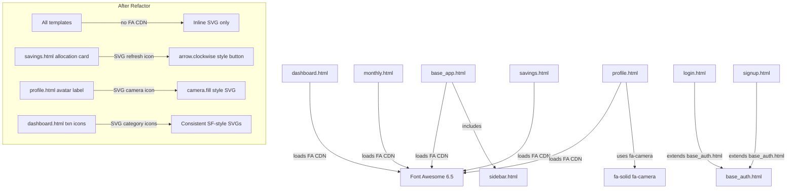
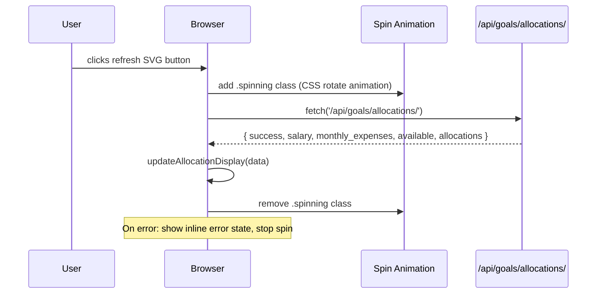
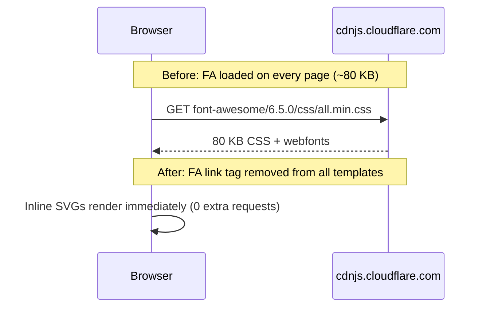

# Design Document: Apple-Style Icon Refresh & UI Polish

## Overview

SpendWise already has a strong Apple-inspired aesthetic — SF Pro fonts, glassmorphism cards, and inline SVG icons on most pages. This feature completes that vision by (1) replacing the broken emoji-based refresh button on the "This Month's Allocation" section with a proper SF Symbols-style SVG icon button, and (2) auditing and upgrading every remaining emoji or Font Awesome icon across all pages to clean, minimal, rounded SVG icons that match the existing design language.

The app currently loads Font Awesome 6.5 via CDN on every page but uses it in only one place (`profile.html` — the camera icon on the avatar edit label). All other icons are already inline SVGs. The goal is to eliminate the Font Awesome dependency entirely, replace the one FA usage, and standardise the icon vocabulary across all templates.

---

## Architecture



---

## Sequence Diagrams

### Refresh Button Interaction (Allocation Card)



### Page Load — No Font Awesome



---

## Components and Interfaces

### Component 1: SVG Icon Library (inline, no external dependency)

**Purpose**: Provide a consistent set of SF Symbols-aesthetic SVG icons used across all templates. Icons are inlined directly in HTML — no sprite sheet, no icon font.

**Interface** (HTML pattern):

```html
<!-- Standard icon usage — stroke-based, rounded caps -->
<svg viewBox="0 0 24 24" fill="none" stroke="currentColor"
     stroke-width="1.8" stroke-linecap="round" stroke-linejoin="round"
     width="N" height="N" aria-hidden="true">
  <!-- path data -->
</svg>

<!-- Filled icon (e.g. sidebar nav active state) -->
<svg viewBox="0 0 24 24" fill="currentColor"
     width="N" height="N" aria-hidden="true">
  <!-- path data -->
</svg>
```

**Icon catalogue** (SF Symbols equivalents used in this project):

| Usage | SF Symbol name | SVG description |
|---|---|---|
| Dashboard nav | `square.grid.2x2` | 4 rounded squares |
| Monthly nav | `calendar` | rect + grid dots |
| Savings nav | `clock` | circle + clock hands |
| Logout nav | `rectangle.portrait.and.arrow.right` | door + arrow |
| Light theme | `sun.max` | circle + rays |
| Dark theme | `moon` | crescent |
| Refresh allocation | `arrow.clockwise` | circular arrow |
| Camera (avatar) | `camera` | camera body + lens |
| Email field | `envelope` | rect + chevron |
| Password field | `lock` | padlock |
| User field | `person` | head + shoulders |
| Confirm password | `lock.badge.checkmark` | padlock + check |
| Account card | `creditcard` | card rect |
| Rent category | `house` | house outline |
| Transport | `car` | car outline |
| Health | `heart` | heart |
| Groceries | `bag` | shopping bag |
| Entertainment | `face.smiling` | smiley |
| Shopping | `cart` | shopping cart |
| Food | `fork.knife` | utensils |
| Utilities | `bolt` | lightning bolt |
| Other/default | `plus` | plus sign |
| Edit action | `pencil` | pencil/square |
| Delete action | `trash` | trash can |
| Target/goal | `target` | concentric circles |
| Back arrow | `chevron.left` | left arrow |
| Download | `arrow.down.to.line` | down arrow |
| Chevron down | `chevron.down` | down chevron |
| Verification note | `checkmark.rectangle` | rect + checkmark |

**Responsibilities**:
- All icons use `stroke-width: 1.8` for body icons, `2.0` for action icons
- `stroke-linecap: round` and `stroke-linejoin: round` on all stroke icons
- `aria-hidden="true"` on decorative icons; `aria-label` on interactive icon-only buttons
- `currentColor` for stroke/fill so icons inherit CSS colour automatically
- Size: `19×19` for nav icons, `15×15` for button icons, `13×13` for eyebrow/label icons, `16×16` for category icons

---

### Component 2: Refresh Allocation Button

**Purpose**: Replace the `🔄` emoji button in `savings.html` with a styled SVG icon button that spins during the async fetch and shows an error state on failure.

**Interface** (HTML):

```html
<button class="refresh-allocation-btn" id="refreshAllocation"
        title="Refresh allocation" aria-label="Refresh allocation">
  <svg class="refresh-icon" viewBox="0 0 24 24" fill="none"
       stroke="currentColor" stroke-width="2"
       stroke-linecap="round" stroke-linejoin="round"
       width="16" height="16" aria-hidden="true">
    <path d="M21 12a9 9 0 1 1-2.636-6.364"/>
    <polyline points="21 3 21 9 15 9"/>
  </svg>
</button>
```

**CSS states**:

```css
/* Base */
.refresh-allocation-btn { /* existing styles kept */ }

/* Loading state */
.refresh-allocation-btn.spinning .refresh-icon {
  animation: spin 0.7s linear infinite;
}

@keyframes spin {
  from { transform: rotate(0deg); }
  to   { transform: rotate(360deg); }
}

/* Error state — brief red flash */
.refresh-allocation-btn.error {
  background: rgba(255, 69, 58, 0.15);
  color: var(--negative);
}
```

**JavaScript interface**:

```javascript
// Existing handler in savings.html — augmented
refreshBtn.addEventListener('click', async () => {
  refreshBtn.classList.add('spinning');
  refreshBtn.disabled = true;
  try {
    const res = await fetch('/api/goals/allocations/', {
      headers: { 'X-CSRFToken': CSRF }
    });
    const data = await res.json();
    if (data.success) {
      updateAllocationDisplay(data);
    } else {
      showRefreshError();
    }
  } catch (e) {
    showRefreshError();
  } finally {
    refreshBtn.classList.remove('spinning');
    refreshBtn.disabled = false;
  }
});

function showRefreshError() {
  refreshBtn.classList.add('error');
  setTimeout(() => refreshBtn.classList.remove('error'), 1500);
}
```

**Responsibilities**:
- Visual feedback during async operation (spin animation)
- Error state feedback without blocking the UI
- Accessible: `aria-label`, `title`, `disabled` during fetch
- Replaces emoji `🔄` with proper SVG `arrow.clockwise` equivalent

---

### Component 3: Camera Icon (Profile Avatar)

**Purpose**: Replace `<i class="fa-solid fa-camera"></i>` in `profile.html` — the only remaining Font Awesome usage — with an inline SVG.

**Interface** (HTML):

```html
<!-- Replaces: <i class="fa-solid fa-camera"></i> -->
<svg viewBox="0 0 24 24" fill="none" stroke="currentColor"
     stroke-width="2" stroke-linecap="round" stroke-linejoin="round"
     width="14" height="14" aria-hidden="true">
  <path d="M23 19a2 2 0 0 1-2 2H3a2 2 0 0 1-2-2V8
           a2 2 0 0 1 2-2h4l2-3h6l2 3h4a2 2 0 0 1 2 2z"/>
  <circle cx="12" cy="13" r="4"/>
</svg>
```

**Responsibilities**:
- Visually identical to FA camera icon at small sizes
- Eliminates the last Font Awesome dependency
- Inherits colour from `.pf-avatar-edit` CSS (white on dark overlay)

---

### Component 4: Font Awesome Removal

**Purpose**: Remove the CDN `<link>` tag from all templates that load it.

**Affected files**:
- `templates/login/base_app.html` — remove FA link
- `templates/login/dashboard.html` — remove FA link
- `templates/login/monthly.html` — remove FA link
- `templates/login/savings.html` — remove FA link
- `templates/login/profile.html` — remove FA link (after camera icon replaced)

**Note**: `login.html`, `signup.html`, `signup_verify.html`, and `onboarding.html` extend `base_auth.html`. Check `base_auth.html` for FA link — remove if present.

---

## Data Models

No new data models are required. This is a pure front-end change.

The only data flow change is improved error handling in the existing refresh allocation fetch:

```javascript
// Existing API response shape (unchanged)
{
  success: boolean,
  salary: number,
  monthly_expenses: number,
  available: number,
  allocations: Array<{
    name: string,
    priority: string,
    allocation_percentage: number,
    allocated_this_month: number
  }>
}
```

---

## Key Functions with Formal Specifications

### Function: `showRefreshError()`

**Preconditions**:
- `refreshBtn` element exists in the DOM
- Called only from within the refresh click handler's catch/else branch

**Postconditions**:
- `.error` class added to `refreshBtn` immediately
- `.error` class removed after 1500 ms
- No mutation to allocation display data

**Loop Invariants**: N/A

---

### Function: Icon rendering (declarative)

**Preconditions**:
- SVG `viewBox="0 0 24 24"` on all icons
- `stroke="currentColor"` or `fill="currentColor"` set
- Parent element has a CSS `color` value

**Postconditions**:
- Icon renders at specified `width`/`height`
- Icon colour matches parent `color` property
- Icon scales correctly at all viewport sizes

---

## Error Handling

### Error Scenario 1: Allocation API returns non-OK response

**Condition**: `/api/goals/allocations/` returns HTTP 4xx/5xx or `data.success === false`

**Response**: `showRefreshError()` — button flashes red for 1.5 s; existing allocation data remains visible unchanged

**Recovery**: User can retry by clicking the refresh button again; no page reload required

---

### Error Scenario 2: Network failure during allocation refresh

**Condition**: `fetch()` throws (offline, DNS failure, timeout)

**Response**: Same as Scenario 1 — `showRefreshError()` called from `catch` block

**Recovery**: User retries; no data loss

---

### Error Scenario 3: SVG icon fails to render

**Condition**: Browser does not support inline SVG (extremely rare — IE8 and below only)

**Response**: Icon is invisible; button/link remains functional because text labels or `aria-label` attributes provide context

**Recovery**: No action needed; all supported browsers render inline SVG

---

## Testing Strategy

### Unit Testing Approach

Test the JavaScript refresh handler in isolation:

- Mock `fetch` to return success → verify `.spinning` class added then removed, `updateAllocationDisplay` called
- Mock `fetch` to return `{ success: false }` → verify `showRefreshError` called, display unchanged
- Mock `fetch` to throw → verify `showRefreshError` called, button re-enabled

### Property-Based Testing Approach

Not applicable for this feature (pure UI/icon change with a single async handler).

### Visual / Integration Testing Approach

Manual checklist per page:

| Page | Check |
|---|---|
| `sidebar.html` | All 4 nav icons render; active state highlights correctly |
| `dashboard.html` | Transaction category icons render; edit/delete SVG buttons work |
| `monthly.html` | Download button SVG icons render; month nav arrows render |
| `savings.html` | Refresh button spins on click; SVG renders; error state flashes on failure |
| `profile.html` | Camera SVG renders on avatar overlay; no FA network request in DevTools |
| `login.html` | Email/password field icons render |
| `signup.html` | All 4 field icons render; verification note icon renders |
| All pages | Network tab shows zero requests to `cdnjs.cloudflare.com/font-awesome` |
| Dark mode | All icons inherit correct colour in dark theme |

---

## Performance Considerations

Removing the Font Awesome CDN link eliminates:
- 1 DNS lookup to `cdnjs.cloudflare.com`
- ~80 KB CSS download (`all.min.css`)
- 2–4 webfont file downloads (woff2)

All icons are already inline SVGs or will be after this change. Inline SVGs add negligible HTML weight (each icon path is ~100–200 bytes) and render with zero additional network requests.

---

## Security Considerations

No security surface changes. The Font Awesome CDN removal slightly reduces the third-party script/resource attack surface (no external CSS that could be tampered with via CDN compromise), but this is a minor benefit rather than a primary motivation.

The refresh button's fetch call already uses `X-CSRFToken` header — no changes needed there.

---

## Dependencies

**Removed**:
- `https://cdnjs.cloudflare.com/ajax/libs/font-awesome/6.5.0/css/all.min.css` — removed from all templates

**Added**:
- None — all icons are inline SVG, no new libraries

**Unchanged**:
- All existing CSS variables (`--accent`, `--muted`, `--ink`, etc.) — icons inherit these via `currentColor`
- Existing `.refresh-allocation-btn` CSS in `savings.css` — extended with `.spinning` and `.error` states only
- All Django views and API endpoints — no backend changes required
