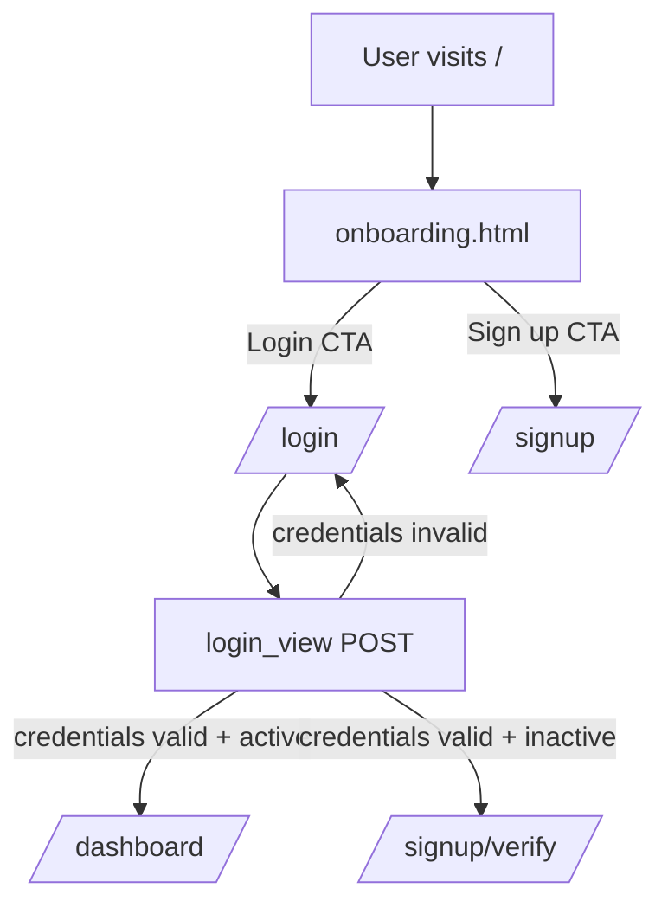
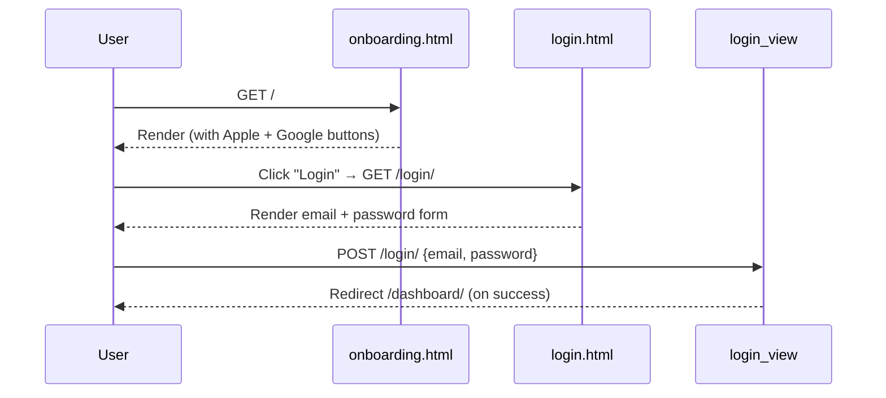
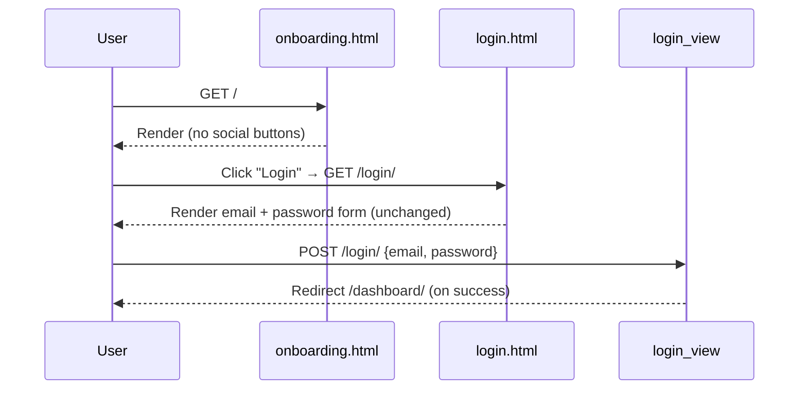

# Design Document: Login Simplification

## Overview

This feature removes OTP (one-time password) verification and Google/Apple social login options from the login flow, leaving only email and password authentication. The goal is a cleaner, lower-friction login experience. No new authentication mechanisms are introduced — the existing Django `authenticate()` / `login()` flow is kept as-is.

**Scope clarification from code audit:**
- `templates/login/login.html` — already contains only email + password fields. No changes needed to the form itself.
- `templates/login/onboarding.html` — contains the Apple and Google social login buttons (`social-row`). These must be removed.
- `login/views.py` (`login_view`) — already performs only email + password auth. The redirect to `signup_verify` for inactive accounts is part of the *signup* flow, not the login flow, and is out of scope.
- `static/login/auth.css` — contains `.social-btn` and `.social-row` styles. These can be removed or left as dead CSS (removal is preferred for cleanliness).

---

## Architecture

The login flow is a standard Django form-POST cycle. No third-party OAuth libraries (allauth, social-auth-app-django) are installed — the social buttons in `onboarding.html` were purely decorative links pointing to ``, not real OAuth endpoints.



The simplification only touches the **onboarding page** (B) and the **CSS file**. The view layer and URL routing are unchanged.

---

## Sequence Diagrams

### Current Login Flow (with social buttons on onboarding)



### Simplified Login Flow (after this feature)



---

## Components and Interfaces

### Component 1: Onboarding Template (`templates/login/onboarding.html`)

**Purpose**: Landing page that presents the app value proposition and entry points to login/signup.

**Current state**: Contains a `<div class="social-row">` block with two `<a class="social-btn">` elements — one for Apple, one for Google. Both link to `` (not real OAuth).

**Change**: Remove the entire `social-row` div and its contents.

**Interface** (relevant HTML structure before → after):

```html
<!-- BEFORE -->
<div class="social-row" aria-label="Social sign in options">
  <a href="" class="social-btn" aria-label="Continue with Apple">
    <!-- Apple SVG -->
  </a>
  <a href="" class="social-btn" aria-label="Continue with Google">
    <!-- Google SVG -->
  </a>
</div>

<!-- AFTER: entire block removed -->
```

**Responsibilities**:
- Display app branding and tagline
- Provide CTA buttons to login and signup
- No social login options

---

### Component 2: Auth Stylesheet (`static/login/auth.css`)

**Purpose**: Styles for all authentication pages (onboarding, login, signup, verify).

**Change**: Remove `.social-btn` and `.social-row` rule blocks. Also remove the responsive overrides for `.social-btn` in the `@media (max-width: 640px)` block.

**CSS selectors to remove**:

```css
/* Remove these blocks entirely */
.social-row { ... }
.social-btn { ... }
.social-btn:hover { ... }
.social-btn svg { ... }

/* Remove from @media (max-width: 640px) */
.social-btn { width: 56px; height: 56px; }
```

**Responsibilities after change**:
- Style login and signup forms
- No social button styles

---

### Component 3: Login View (`login/views.py` — `login_view`)

**Purpose**: Handles GET (render form) and POST (authenticate user) for `/login/`.

**Change**: None required. The view already performs only email + password authentication.

**Current implementation** (no change):

```python
def login_view(request: HttpRequest) -> HttpResponse:
    if request.user.is_authenticated:
        return redirect("dashboard")

    if request.method == "POST":
        email = request.POST.get("email", "").strip().lower()
        password = request.POST.get("password", "")

        errors = {}
        if not email:
            errors["email"] = "Email is required."
        if not password:
            errors["password"] = "Password is required."

        if not errors:
            user = authenticate(request, username=email, password=password)
            if user is not None:
                login(request, user)
                return redirect("dashboard")
            else:
                pending_user = User.objects.filter(email=email).first()
                if (
                    pending_user
                    and pending_user.check_password(password)
                    and not pending_user.is_active
                ):
                    request.session[EMAIL_VERIFICATION_SESSION_KEY] = pending_user.id
                    return redirect("signup_verify")
                errors["general"] = "Invalid email or password."

        return render(
            request, "login/login.html", {"errors": errors, "form": request.POST}
        )

    return render(request, "login/login.html")
```

---

### Component 4: Login Template (`templates/login/login.html`)

**Purpose**: Renders the email + password login form.

**Change**: None required. The template already contains only email and password fields with no OTP input or social buttons.

---

## Data Models

No data model changes. The `UserProfile` model retains `email_is_verified`, `email_verification_code`, and `email_verification_sent_at` fields — these are used by the signup verification flow, which is out of scope.

---

## Key Functions with Formal Specifications

### `login_view(request)` — unchanged, documented for completeness

```python
def login_view(request: HttpRequest) -> HttpResponse
```

**Preconditions:**
- `request` is a valid Django `HttpRequest`
- If POST: `request.POST` contains `email` and `password` keys

**Postconditions:**
- GET: renders `login/login.html` with no context errors
- POST (valid active user): redirects to `dashboard`
- POST (valid inactive user): redirects to `signup_verify`
- POST (invalid credentials): re-renders `login/login.html` with `errors` context

**Invariants:**
- Never exposes whether an email exists in the system via distinct error messages
- CSRF token is always validated (Django middleware)

---

## Algorithmic Pseudocode

### Onboarding Template Rendering (after simplification)

```pascal
PROCEDURE render_onboarding(request)
  INPUT: request (GET)
  OUTPUT: HTML response

  SEQUENCE
    context ← {}
    template ← load_template("login/onboarding.html")
    
    // Template contains: brand, tagline, CTA buttons (Login, Sign up)
    // Template does NOT contain: social-row, social-btn elements
    
    RETURN render(template, context)
  END SEQUENCE
END PROCEDURE
```

### CSS Cleanup

```pascal
PROCEDURE remove_social_styles(auth_css)
  INPUT: auth_css file
  OUTPUT: updated auth_css file

  SEQUENCE
    // Remove top-level social blocks
    REMOVE block ".social-row { ... }" FROM auth_css
    REMOVE block ".social-btn { ... }" FROM auth_css
    REMOVE block ".social-btn:hover { ... }" FROM auth_css
    REMOVE block ".social-btn svg { ... }" FROM auth_css

    // Remove responsive override
    WITHIN "@media (max-width: 640px)" IN auth_css DO
      REMOVE rule ".social-btn { width: 56px; height: 56px; }"
    END WITHIN

    RETURN auth_css
  END SEQUENCE
END PROCEDURE
```

---

## Example Usage

After the change, the onboarding page renders without social buttons:

```python
# GET /  →  onboarding view renders onboarding.html
# The template no longer includes:
#   <div class="social-row">...</div>
#
# It still includes:
#   <a href="" class="cta-btn">Login →</a>
#   <a href="" class="cta-btn cta-dark">Create account →</a>
```

The login page is unchanged and continues to work:

```python
# POST /login/  with  {"email": "user@example.com", "password": "secret"}
# → authenticate(request, username="user@example.com", password="secret")
# → login(request, user)
# → redirect("dashboard")
```

---

## Correctness Properties

1. After the change, `onboarding.html` must not contain any element with `class="social-btn"` or `class="social-row"`.
2. After the change, `auth.css` must not contain a `.social-btn` or `.social-row` selector.
3. The login form at `/login/` must accept exactly two inputs: `email` and `password`.
4. A POST to `/login/` with valid credentials must redirect to `/dashboard/` — this behaviour is unchanged.
5. No OAuth or third-party authentication endpoint is introduced.
6. The signup flow (`/signup/` and `/signup/verify/`) is unaffected.

---

## Error Handling

| Scenario | Current behaviour | After change |
|---|---|---|
| User submits empty email | Field error: "Email is required." | Unchanged |
| User submits empty password | Field error: "Password is required." | Unchanged |
| Invalid credentials | General error: "Invalid email or password." | Unchanged |
| Inactive account (unverified signup) | Redirect to `/signup/verify/` | Unchanged |
| User clicks Apple/Google button | Redirects to `/signup/` (decorative) | Button removed — no longer possible |

---

## Testing Strategy

### Unit Testing Approach

- `login_view` GET: assert response status 200 and template `login/login.html` is used.
- `login_view` POST valid credentials: assert redirect to `dashboard`.
- `login_view` POST invalid credentials: assert re-render with `errors.general`.
- `login_view` POST inactive user: assert redirect to `signup_verify`.

### Property-Based Testing Approach

Not applicable for this UI-only change. The view logic is unchanged.

### Integration / Smoke Testing

- Load `/` (onboarding): assert no element with `aria-label="Continue with Apple"` or `aria-label="Continue with Google"` in the response HTML.
- Load `/login/`: assert the form contains `input[name="email"]` and `input[name="password"]`, and no `input[name="code"]` or `input[name="otp"]`.

---

## Security Considerations

- Removing the social buttons does not weaken authentication — they were decorative links to `/signup/`, not real OAuth flows.
- The email + password path uses Django's `authenticate()` which handles timing-safe password comparison.
- No new attack surface is introduced.

---

## Dependencies

No new dependencies. No existing dependencies are removed. The change is purely template and CSS.
